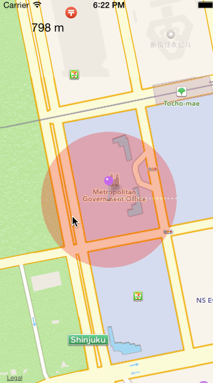

ResizableMKCircleOverlay
========================
A resizable map circle overlay.  

Objective:
======
Have a resizable circle overlay, without recreating an MKCircle object.   

How to use:
======
CustomMapOverlay is a subclass of MKCircleView.  In your map controller override 'viewForOverlay with the custom class.

```objective-c
- (MKOverlayRenderer *)mapView:(MKMapView *)mapView rendererForOverlay:(id < MKOverlay >)overlay{
    circleView = [[CustomMKCircleOverlay alloc] initWithCircle:overlay];
    circleView.fillColor = [UIColor redColor];
    
    return circleView;
}
```

##### Initilize
**-(id)initWithCircle:(MKCircle *) circle withRadius:(double)radius withMin:(int) min withMax:(int) max;**   
**-(id)initWithCircle:(MKCircle *) circle withRadius:(double)radius;**   
**-(id)initWithCircle:(MKCircle *) circle;**   

-radius is always in meters   
-min/max will set a min and max size for the circle (also meters).   

##### UpdateCircle  
**-(void)setCircleOffset:offset;** - passing 0 will set the circle to the inital radius.  
**-(void)setCircleRadius:radius;** - set the cirlce radius.  
    
       
This class alone does not handle Gestures so you will need to implement that on your own or take a look at the example project.  The example project uses 'WildcardGestureRecognizer' to detect if the overlay was touched.  
   
Sample:
======
   
   
   [Demo Video](screenshots/circleoverlay.mov)

